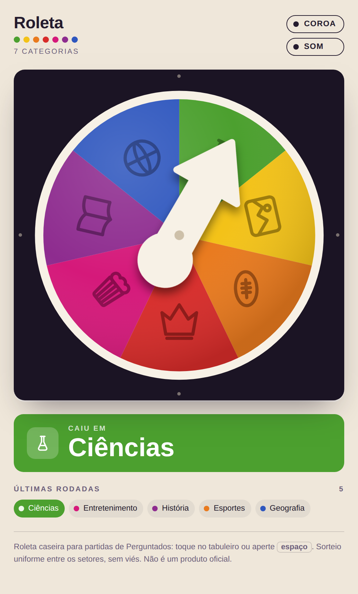
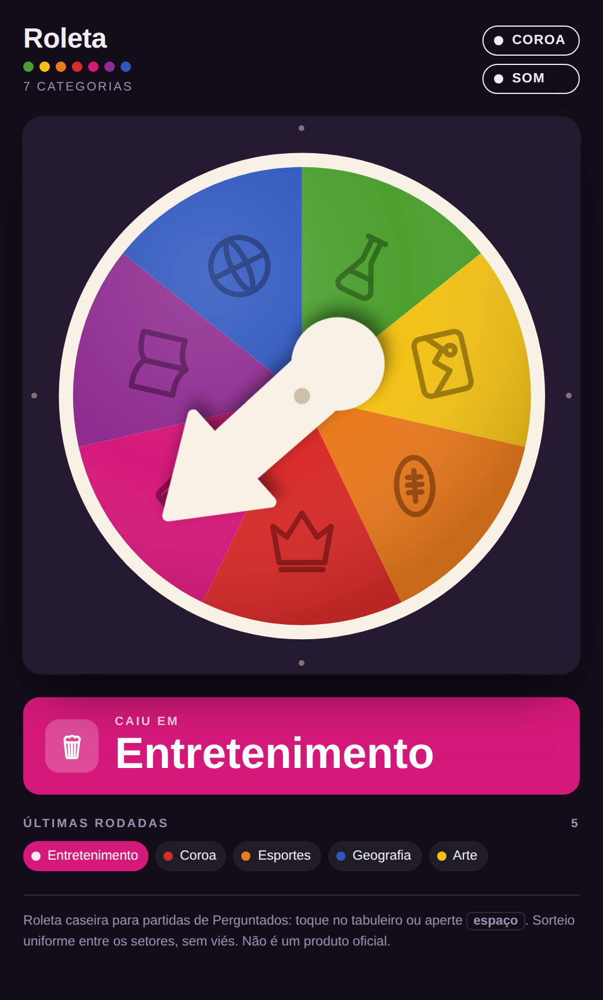

# Roleta do Perguntados

A spinner wheel for Perguntados / Trivia Crack board game sessions. Tap the board and the pointer spins until it stops on a category.

**Live:** https://felladrin.github.io/roleta-perguntados/

| Light | Dark |
| --- | --- |
|  |  |

## What it does

- Seven sectors: Geografia, História, Ciências, Arte, Esportes, Entretenimento and Coroa. The **Coroa** toggle drops the wheel to six real sectors rather than skipping a drawn one.
- The pointer spins over a fixed disc, the same way the cardboard spinner works.
- One tick per sector the pointer crosses, decelerating along with it. **Som** turns it off.
- Last eight rounds stay on screen.
- Space bar spins. Honours `prefers-reduced-motion` (jumps straight to the result) and follows the system light/dark theme.
- The Coroa and Som choices persist in `localStorage`.

## Fair draw

The target sector is drawn uniformly first, and the final angle is derived from it — never the other way round. The landing point is always at least 9.8° from a sector border, so the pointer never stops somewhere ambiguous.

Verified two ways: 600,000 simulated spins stay within the expected range for a uniform draw (χ² = 6.4 on 6 d.f. for seven sectors, 8.5 on 5 d.f. for six), and 48 headless-browser spins hit-test the pixel under the pointer tip against the announced category, matching every time in both modes.

## Running it

One file, no build step, no dependencies:

```sh
python3 -m http.server
```

Then open `http://localhost:8000`. Opening `index.html` straight from the filesystem works too.

The only external request is the Google Fonts stylesheet (Baloo 2 and Archivo). Offline, it falls back to system faces.

## Notes

Perguntados and Trivia Crack are trademarks of Etermax. This is an unofficial spinner with its own icons, not affiliated with or endorsed by Etermax.

## License

MIT
